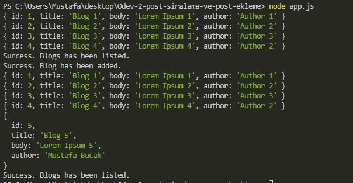

# Ödev 2 - Post Sıralama ve Post Ekleme

I wrote a program that simulates adding and listing new blogs to the blog list using async-await and promise.

## Screenshot:



## Installation

First clone the project

### Method 1: Cloning the Entire Repository

[Git Here](https://git-scm.com/downloads)

```
git clone https://github.com/mustafabucak01/PatikaDevProjects.git
```

### Method 2: Clone Only Related Project

Right click on an empty space in the folder where you will clone the project and select "Git Bash Here". Then follow the steps below.

```
git clone --filter=blob:none --sparse https://github.com/mustafabucak01/PatikaDevProjects
cd PatikaDevProjects
git sparse-checkout add NodeJS/Odev-2-post-siralama-ve-post-ekleme
```

## Usage

You can run the code typing "node app.js".

## NodeJS Course

[www.patika.dev](https://www.patika.dev)
